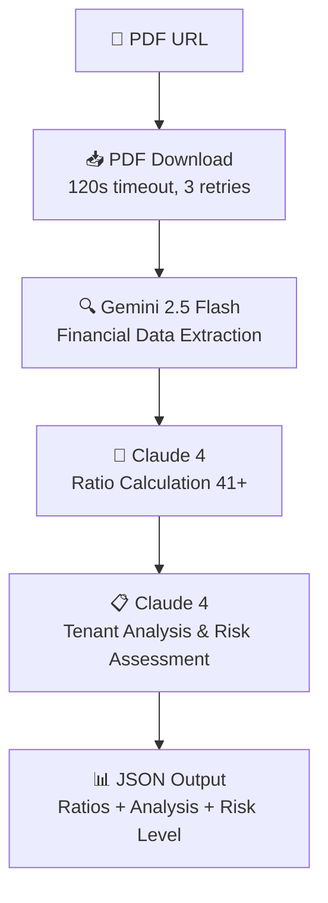

# SpiritGenius - Financial Analysis API for Tenant Solvency Evaluation

A professional FastAPI application designed for commercial real estate professionals to evaluate tenant solvency for rental properties. The system processes financial statements (PDF documents) using a sophisticated **three-step LLM pipeline** to extract data, calculate 41+ financial ratios, and provide comprehensive tenant risk assessment in French.

## Key Features

- **🏢 Tenant Solvency Evaluation**: Specialized analysis for commercial rental decisions with risk levels and recommendations
- **📊 Comprehensive Financial Analysis**: 41+ ratios across 6 major categories (Structure, Exploitation, Rentabilité, etc.)
- **📄 PDF Processing**: Robust download and analysis of financial statements from URLs with retry logic
- **🤖 Three-Step AI Pipeline**:
  1. **Gemini 2.5 Flash**: Raw financial data extraction from balance sheets & income statements
  2. **Claude 4**: Financial ratio calculation (41+ ratios with precise formulas)
  3. **Claude 4**: Professional tenant solvency analysis with 800-word French report
- **💰 Rental Capacity Analysis**: Integrates annual rent amount for capacity evaluation (loyer/CA, loyer/EBE ratios)
- **🎯 Risk Assessment**: Clear tenant risk levels (faible/moyen/élevé) with specific recommendations
- **🇫🇷 French Professional Output**: Optimized for French financial terminology and rental market
- **⚡ High-Performance Architecture**: Sequential processing with robust error handling
- **🔗 API-Ready**: FastAPI with CORS support for frontend integration

## Architecture

**SpiritGenius** employs a professional-grade, sequential three-step AI pipeline designed specifically for tenant solvency evaluation in commercial real estate:

### 🔄 Processing Pipeline

1. **📥 PDF Download**: Robust document retrieval with 120s timeout and 3-retry exponential backoff
2. **🔍 Data Extraction (Gemini 2.5 Flash)**: Raw financial data extraction from PDF documents
3. **🧮 Ratio Calculation (Claude 4)**: Professional computation of 41+ financial ratios
4. **📋 Final Analysis (Claude 4)**: Comprehensive tenant solvency evaluation with risk assessment

### 🏗️ Technical Architecture

- **FastAPI Backend**: RESTful API with comprehensive CORS support
- **Async PDF Processing**: High-performance document download with error handling
- **Sequential LLM Pipeline**: Each step builds on previous outputs for maximum accuracy
- **Modular Design**: Clean separation of concerns for maintainability
- **Professional Error Handling**: Comprehensive logging and error recovery at each step

### 📁 Module Responsibilities

- **`main.py`**: FastAPI application with CORS and request/response handling
- **`app.py`**: Orchestrates the complete 4-step tenant evaluation pipeline
- **`clients.py`**: Initializes and manages AI client connections (Gemini & Claude)
- **`pdf_handler.py`**: Robust PDF download with timeout and retry logic
- **`gemini_service.py`**: Financial data extraction from PDF documents (balance sheets, income statements)
- **`claude_ratio_service.py`**: Professional calculation of 41+ financial ratios with precise formulas
- **`claude_service.py`**: Final tenant solvency analysis with 800-word French evaluation and risk assessment
- **`logger.py` & `logging_config.py`**: Comprehensive logging infrastructure

## API Endpoints

### POST /api/insights

Accepts a JSON payload with PDF URL, company name, and annual rent amount, returns comprehensive tenant solvency evaluation in French.

**Request:**

```json
{
  "pdfUrl": "https://example.com/company-accounts.pdf",
  "companyName": "Example Company",
  "annualRent": "50000"
}
```

**Response:**

Complete tenant solvency evaluation structured in JSON format:

```json
{
  "ratios": {
    "structure_financiere": {
      "ressources_propres_n": 85420,
      "frng_n": 12450,
      "bfr_n": 8730,
      "tresorerie_nette_n": 3720,
      "independance_financiere_n": 0.68,
      // ... 15 structure ratios
    },
    "activite_exploitation": {
      "marge_globale_n": 0.312,
      "valeur_ajoutee_n": 47560,
      "ebe_n": 14230,
      "caf_n": 12180,
      // ... 12 exploitation ratios
    },
    "rentabilite": {
      "roe_n": 0.085,
      "rentabilite_economique_n": 0.092,
      // ... 5 profitability ratios
    },
    "evolution": {
      "taux_variation_ca": 0.035,
      "taux_variation_resultat_net": -0.932,
      // ... 4 evolution ratios
    },
    "tresorerie_financement": {
      "capacite_generation_cash_n": 12180,
      "capacite_remboursement_n": 3.16,
      // ... 3 treasury ratios
    },
    "delais_paiement": {
      "delai_creances_clients_jours": 45,
      "delai_dettes_fournisseurs_jours": 38
    }
  },
  "chiffres_cles": {
    "chiffre_affaires_n": "152 450 K€",
    "resultat_exploitation_n": "8 450 K€",
    "marge_exploitation_n": "5.54%",
    "resultat_net_n": "1 274 K€",
    "capitaux_propres_n": "85 420 K€",
    "dette_financiere_n": "38 450 K€",
    "loyer_sur_ca_n": "3.28%",
    "loyer_sur_ebe_n": "35.14%",
    // ... 24 key figures total
  },
  "analyse": "Comprehensive 800-word French analysis covering financial evolution, structure, profitability, cash flow, operations, and risk assessment with clear tenant recommendation",
  "processing_time": 45.67
}
```

**Analysis Structure:**
- **Évolution des indicateurs**: Year-over-year financial performance
- **Structure financière**: Balance sheet strength and stability
- **Rentabilité**: Profitability metrics and trends
- **CAF et trésorerie**: Cash generation and financial capacity
- **Exploitation**: Operational efficiency analysis  
- **Cycle d'exploitation**: Working capital management
- **Conclusion**: Tenant risk level (faible/moyen/élevé) with specific recommendations

### GET /health

Health check endpoint to verify the API is running.

## 🏃‍♂️ Quick Start

### Prerequisites
- **Python 3.9+**
- **Google Gemini API key** ([Get here](https://aistudio.google.com/app/apikey))
- **Anthropic Claude API key** ([Get here](https://console.anthropic.com/))

### Local Development

```bash
# 1. Clone the repository
git clone https://github.com/yourusername/spiritgenius.git
cd spiritgenius

# 2. Install dependencies
pip install -r requirements.txt

# 3. Configure environment variables
cp .env.example .env
# Edit .env with your API keys

# 4. Run the application
hypercorn main:app --reload --bind "localhost:8000"
```

**Local URL**: `http://localhost:8000/api/insights`

### Test the API

```bash
curl -X POST "http://localhost:8000/api/insights" \
  -H "Content-Type: application/json" \
  -d '{
    "pdfUrl": "https://example.com/financial-statements.pdf",
    "companyName": "Test Company SAS",
    "annualRent": "75000"
  }'
```

## 🔧 Environment Variables

Create a `.env` file in the project root:

```bash
# Required API Keys
CLAUDE_API_KEY=your_claude_api_key_here
GEMINI_API_KEY=your_gemini_api_key_here
```

## 🚀 Deployment

### Railway (Recommended)

1. **Fork this repository** to your GitHub account
2. **Create new Railway project** from your forked repository
3. **Configure environment variables** in Railway dashboard:
   - `CLAUDE_API_KEY`: Your Anthropic Claude API key
   - `GEMINI_API_KEY`: Your Google Gemini API key
4. **Deploy automatically** - Railway will use `railway.json` configuration

### Manual Deployment

```bash
# Install dependencies
pip install -r requirements.txt

# Set environment variables
export CLAUDE_API_KEY="your_key_here"
export GEMINI_API_KEY="your_key_here"

# Run the application
hypercorn main:app --bind "0.0.0.0:8000"
```

**Production URL**: `https://your-app.railway.app/api/insights`

## 🔄 Data Flow & Processing

**SpiritGenius** follows a precise 4-step sequential pipeline:



### **Step Details:**

1. **📥 PDF Download** (30-60s)
   - Robust aiohttp download with exponential backoff
   - 120-second timeout with 3 retry attempts
   - Handles network errors and server issues

2. **🔍 Data Extraction** (15-30s)
   - Gemini 2.5 Flash processes PDF content
   - Extracts 25+ financial line items
   - Returns structured JSON data array

3. **🧮 Ratio Calculation** (10-20s)
   - Claude 4 calculates 41+ professional ratios
   - Uses precise French accounting formulas
   - Includes rental-specific metrics

4. **📋 Final Analysis** (20-40s)
   - Claude 4 performs comprehensive tenant evaluation
   - 800-word French analysis across 7 sections
   - Risk assessment with actionable recommendations

**Total Processing Time**: ~75-150 seconds

## 💼 Use Cases

### **Commercial Real Estate**
- **Property Managers**: Evaluate prospective tenants before lease signing
- **Real Estate Agencies**: Provide professional tenant assessments to property owners
- **Banks & Lenders**: Assess tenant quality for property financing decisions
- **Investment Funds**: Evaluate tenant portfolios for acquisition due diligence

### **Financial Analysis**
- **Accountants**: Generate comprehensive ratio analysis reports
- **Financial Advisors**: Assess client company financial health
- **Business Consultants**: Provide structured financial evaluations
- **Credit Analysts**: Evaluate borrower financial capacity

## Financial Ratios Calculated

**SpiritGenius** calculates **41+ professional financial ratios** using precise formulas across 6 major categories:

### 1. **Structure Financière** (15 ratios)
- **Ressources propres**: Capitaux propres + Provisions pour risques
- **Ressources stables**: Ressources propres + Dettes financières LT
- **FRNG**: Ressources stables - Actif immobilisé net
- **BFR**: (Stocks + Créances) - (Dettes fournisseurs + Dettes fiscales/sociales)
- **Trésorerie nette**: Disponibilités - Concours bancaires CT
- **Surface financière**: Ressources stables / Immobilisations nettes
- **Indépendance financière**: Capitaux propres / Total passif
- **Couverture immobilisations**, **Capital d'exploitation**, etc.

### 2. **Activité d'Exploitation** (12 ratios)
- **Marge globale**: (CA - Achats) / CA
- **Valeur ajoutée**: CA - Consommations externes
- **EBE**: VA - Charges de personnel - Impôts/taxes
- **CAF**: Résultat net + Dotations amortissements/provisions
- **Charges personnel/VA**, **Impôts/VA**, **Charges financières/VA**
- **Taux marge bénéficiaire**, **Taux marge brute d'exploitation**
- **Marge brute autofinancement**: CAF / CA

### 3. **Rentabilité** (5 ratios)
- **ROE**: Résultat net / Capitaux propres moyens
- **Rentabilité économique**: (Résultat + Charges financières) / Total actif
- **Rentabilité financière**: Résultat financier / Dettes financières
- **Rentabilité brute/nette** ressources stables et capital exploitation

### 4. **Évolution** (4 ratios)
- **Taux variation CA**: (CA_n - CA_n-1) / CA_n-1
- **Taux variation VA**: (VA_n - VA_n-1) / VA_n-1
- **Taux variation résultat net**: (RN_n - RN_n-1) / RN_n-1
- **Taux variation capitaux propres**: (CP_n - CP_n-1) / CP_n-1

### 5. **Trésorerie & Financement** (3 ratios)
- **Capacité génération cash (Méthode 1)**: EBE - Variation BFR
- **Capacité génération cash (Méthode 2)**: CAF - Variation BFR
- **Capacité remboursement**: Dettes financières / CAF

### 6. **Délais de Paiement** (2 ratios)
- **Délai créances clients**: (Créances clients / CA TTC) × 365
- **Délai dettes fournisseurs**: (Dettes fournisseurs / Achats TTC) × 365

### 🏢 **Tenant-Specific Ratios**
- **Loyer/CA**: Annual rent / Revenue (rental capacity indicator)
- **Loyer/EBE**: Annual rent / EBITDA (cash flow coverage)

All ratios calculated for current year (N) and previous year (N-1) when data available.

## 🎯 Tenant Risk Assessment

**SpiritGenius** provides professional tenant solvency evaluation specifically designed for commercial real estate:

### **Risk Levels:**
- **🟢 Risque faible**: Strong financial health, favorable rental recommendation
- **🟡 Risque moyen**: Mixed financial indicators, recommendation with conditions/guarantees
- **🔴 Risque élevé**: Concerning financial situation, unfavorable rental recommendation

### **Evaluation Methodology:**
- **📈 Revenue Analysis**: Turnover stability, growth trends, and market position
- **🏗️ Financial Structure**: Equity strength, debt levels, and financial independence
- **💰 Rental Capacity**: Loyer/CA and Loyer/EBE ratios for payment capacity assessment
- **💸 Cash Flow**: CAF analysis and cash generation sustainability
- **📊 Profitability**: Margin evolution and operational efficiency
- **⏰ Working Capital**: BFR management and payment cycle optimization
- **🔄 Evolution Trends**: Year-over-year performance indicators

### **Tenant-Specific Analysis:**
- **Payment Capacity**: Rent as % of revenue and EBITDA
- **Financial Stability**: Multi-year trend analysis
- **Operational Efficiency**: Margin and cost structure evaluation
- **Growth Sustainability**: Revenue and profitability trends
- **Risk Mitigation**: Specific recommendations for rental agreements

## 📁 Project Structure

```
spiritgenius/
├── main.py                    # 🚀 FastAPI application with CORS support
├── app.py                     # 🔄 4-step tenant evaluation pipeline orchestrator
├── clients.py                 # 🤖 AI client initialization (Gemini & Claude)
├── pdf_handler.py             # 📄 Robust PDF download with retry logic
├── gemini_service.py          # 🔍 Gemini 2.5 Flash - financial data extraction
├── claude_ratio_service.py    # 🧮 Claude 4 - professional ratio calculation (41+ ratios)
├── claude_service.py          # 📋 Claude 4 - final tenant solvency analysis
├── logger.py                  # 📝 Logger instance
├── logging_config.py          # ⚙️ Comprehensive logging configuration
├── requirements.txt           # 📦 Python dependencies
├── .env                       # 🔐 Environment variables (API keys)
├── railway.json               # 🚂 Railway deployment configuration
└── README.md                  # 📖 Project documentation
```

### **Tech Stack:**
- **Backend**: FastAPI 0.100.0 with Hypercorn ASGI server
- **AI Models**: Google Gemini 2.5 Flash + Anthropic Claude 4
- **PDF Processing**: aiohttp with async download and retry logic
- **Deployment**: Railway.app with Nixpacks builder
- **Dependencies**: python-dotenv, anthropic, google-genai, pydantic 2.0+
